# DevJobs

Aplicación móvil de búsqueda de ofertas de trabajo tech, construida con React Native y Expo como proyecto de portfolio. Desarrollada en paralelo con los estudios de Ingeniería de Software y con el proyecto freelance [AnaGlor Studio](https://www.anaglorstudio.com/) — un estudio de Pilates en Madrid para el que desarrollé la web completa simultáneamente.

---

## Capturas

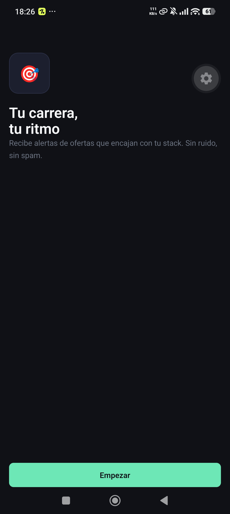
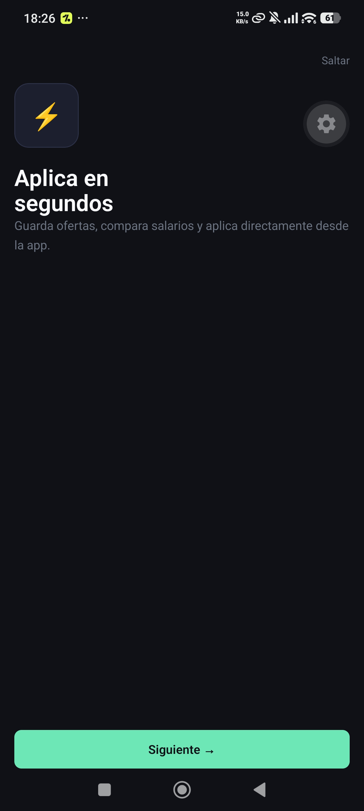

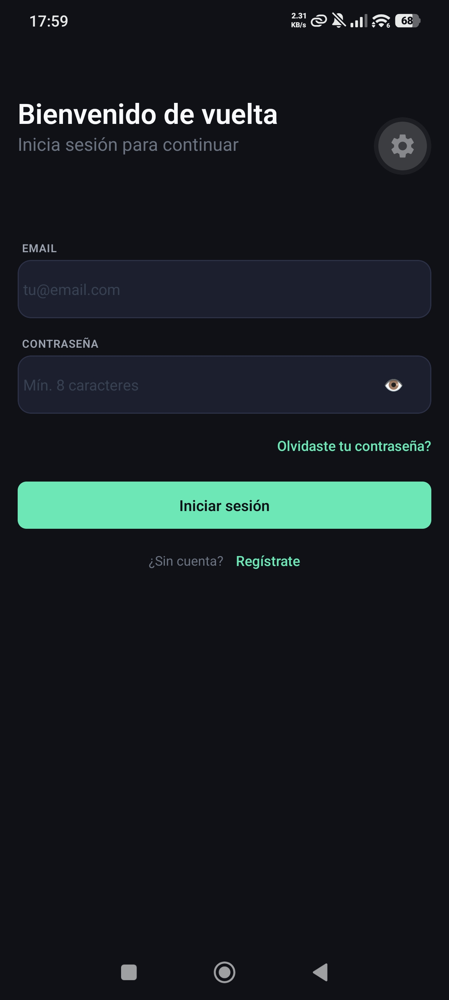
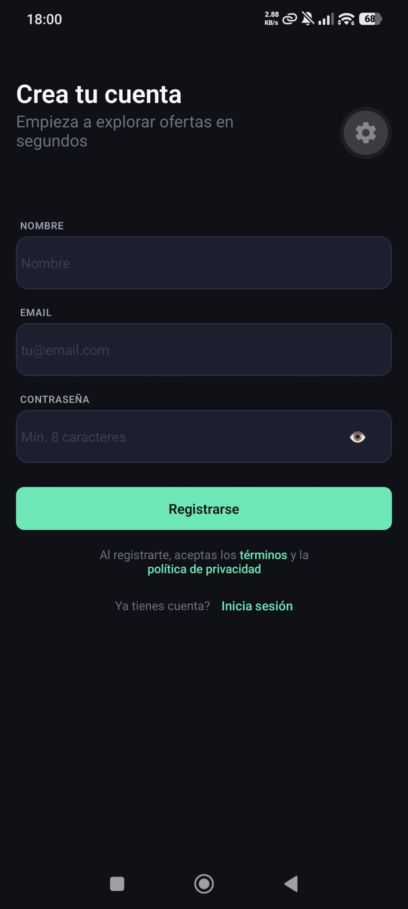
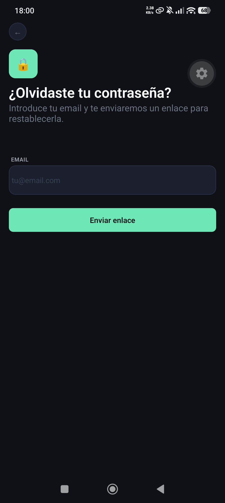
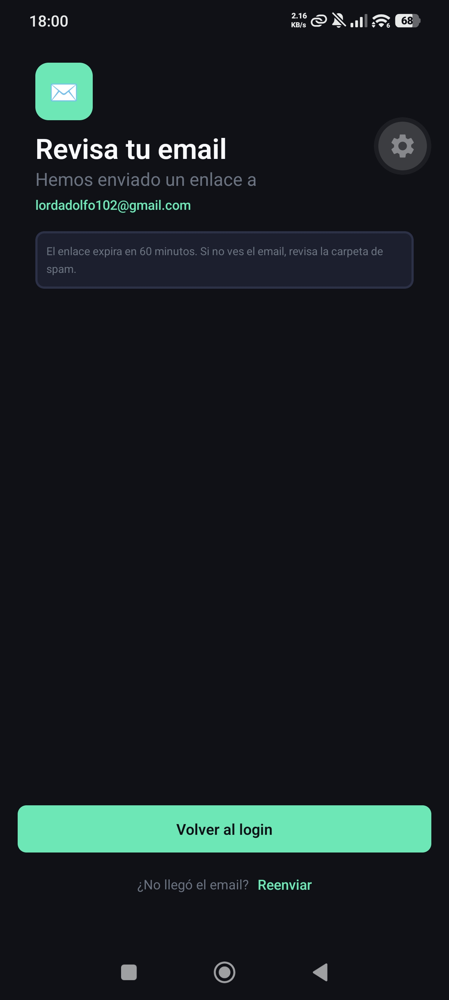
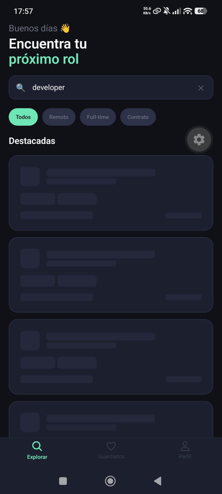
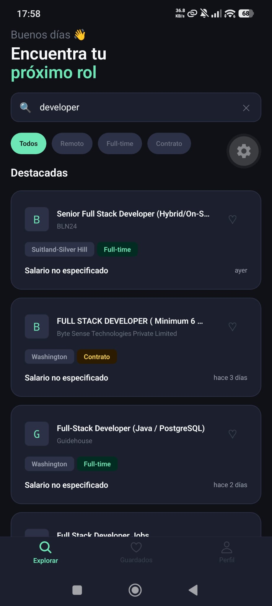

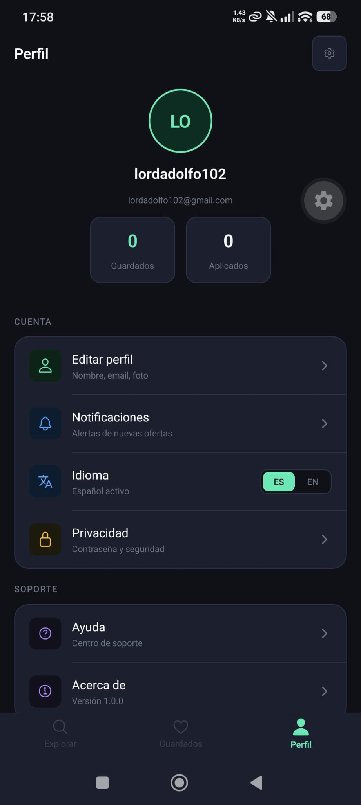
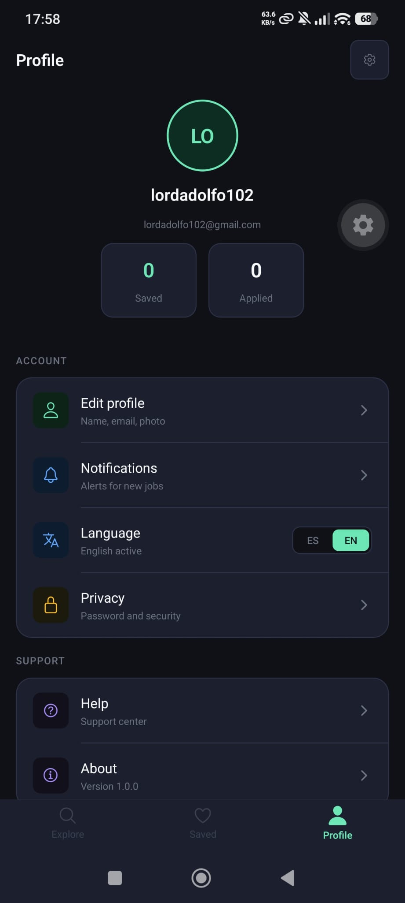
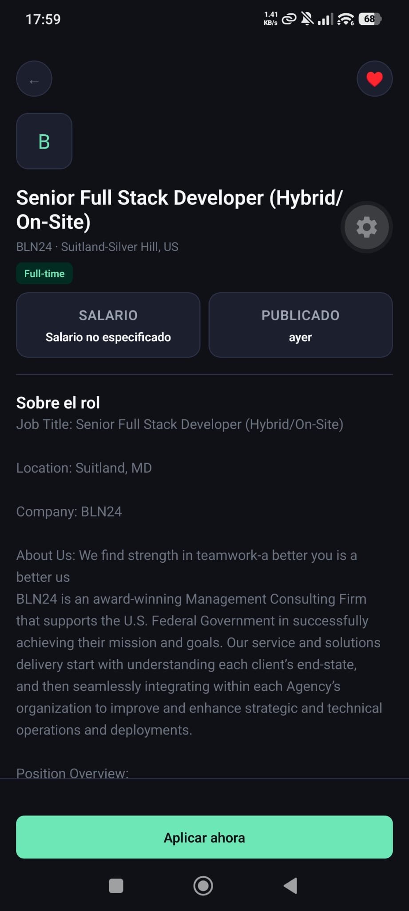
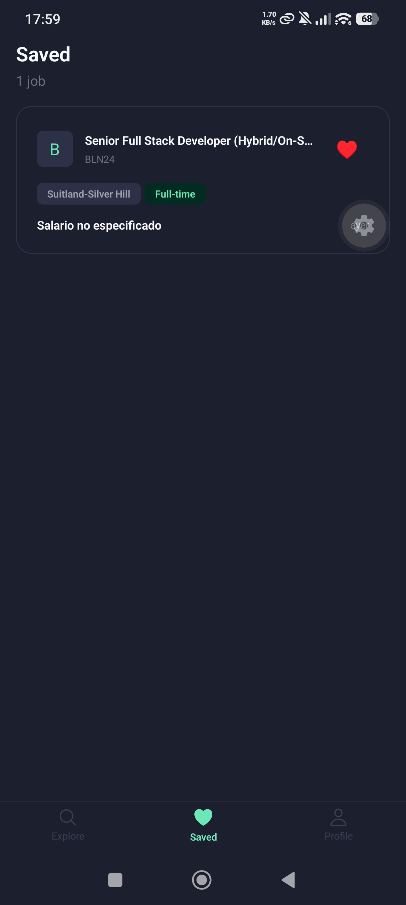
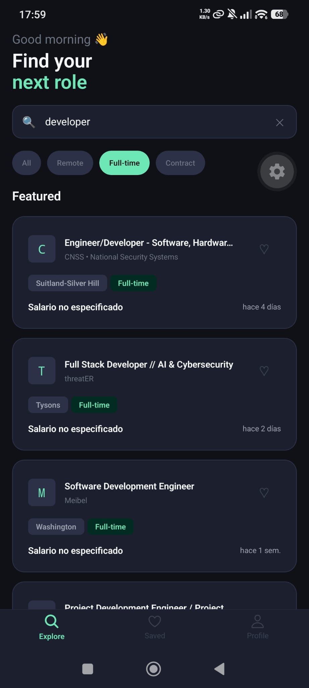

---

## Stack

| Capa               | Tecnología                       |
| ------------------ | -------------------------------- |
| Framework          | React Native + Expo SDK 56       |
| Navegación         | Expo Router (file-based routing) |
| Backend / Auth     | Supabase (JWT + SecureStore)     |
| Base de datos      | Supabase (PostgreSQL + RLS)      |
| Ofertas de trabajo | JSearch API (RapidAPI)           |
| Estado global      | Zustand                          |
| Formularios        | react-hook-form + Zod            |
| Iconos             | @expo/vector-icons (Ionicons)    |
| i18n               | Sistema propio (ES / EN)         |

---

## Funcionalidades implementadas

### Autenticación

- Onboarding de 3 slides con FlatList horizontal
- Registro con validación de contraseña en tiempo real
- Login con Supabase Auth
- Confirmación de email
- Recuperación de contraseña
- Guardia de navegación en `_layout.jsx` con `onAuthStateChange`

### Búsqueda de ofertas

- Búsqueda en tiempo real con debounce de 500ms
- Filtros por tipo de empleo (Remoto, Full-time, Contrato)
- Paginación infinita
- Caché en memoria para evitar llamadas duplicadas
- Skeletons animados durante la carga
- Estado de error con botón de reintento

### Detalle de oferta

- Salario, ubicación, tipo de contrato
- Descripción, responsabilidades y requisitos
- Botón "Aplicar ahora" que abre el link real con `Linking.openURL`

### Favoritos

- Guardar y quitar favoritos con actualización optimista
- Persistencia en Supabase vinculada al usuario autenticado
- Sincronización entre dispositivos con la misma cuenta
- Políticas RLS para que cada usuario solo acceda a sus datos

### Perfil

- Avatar con iniciales generado automáticamente
- Contador de ofertas guardadas en tiempo real
- Toggle de idioma ES / EN con persistencia en AsyncStorage
- Logout con confirmación

### Internacionalización

- Sistema propio sin dependencias externas
- Cadenas separadas por pantalla en `src/i18n/`
- Hook `useTranslation()` con la misma firma que react-i18next para facilitar migración futura
- Store independiente con Zustand + AsyncStorage

---

## Arquitectura

```
app/
├── _layout.jsx              # Guardia de navegación + carga de estado inicial
├── (auth)/
│   ├── onboarding.jsx
│   ├── login.jsx
│   ├── register.jsx
│   ├── forgot-password.jsx
│   └── confirm-email.jsx
├── (tabs)/
│   ├── _layout.jsx          # Tab bar con Ionicons
│   ├── index.jsx            # HomeScreen
│   ├── saved.jsx            # SavedScreen
│   └── profile.jsx          # ProfileScreen
└── job/[id].jsx             # DetailScreen

src/
├── theme/                   # Sistema de diseño (colors, typography, spacing)
├── i18n/                    # Traducciones ES / EN
├── services/
│   ├── supabase.js
│   └── jsearch.js
├── hooks/
│   ├── useJobs.js           # Búsqueda + debounce + caché + paginación
│   └── useTranslation.js
├── store/
│   ├── savedStore.js        # Favoritos sincronizados con Supabase
│   └── languageStore.js     # Idioma persistido en AsyncStorage
├── components/
│   ├── job/
│   │   ├── JobCard.jsx
│   │   └── JobCardSkeleton.jsx
│   ├── home/
│   │   └── ListHeaderComponent.jsx
│   └── profile/
│       └── SettingRow.jsx
├── styles/                  # Archivos .styles.js por pantalla
├── schemas/                 # Zod schemas
└── utils/
    └── formatters.js
```

---

## Pendiente / No implementado

Estas funcionalidades están planificadas pero no completadas, principalmente por dos razones: el plan gratuito de JSearch (RapidAPI) tiene un límite de 200 llamadas al mes que se agotó durante el desarrollo, y el tiempo disponible estuvo repartido entre los estudios de Ingeniería de Software y el desarrollo simultáneo de [AnaGlor Studio](https://www.anaglorstudio.com/).

- **Traducción completa de la app** — el sistema de i18n está implementado y funciona en ProfileScreen, pero HomeScreen, SavedScreen y DetailScreen aún usan cadenas en español directamente. La arquitectura está lista para extenderlo.
- **Datos mock** — sin un fallback de datos locales, la app queda inutilizable al agotar el límite de la API. Pendiente crear `mockJobs.js` con un flag `USE_MOCK` en `jsearch.js`.
- **Seguimiento de aplicaciones** — el contador "Aplicados" en el perfil está hardcodeado a 0. Requeriría una tabla `applied_jobs` en Supabase similar a `saved_jobs`.
- **Editar perfil** — nombre y foto de perfil desde Supabase Storage.
- **Notificaciones push** — alertas de nuevas ofertas con Expo Notifications.
- **Tests** — sin cobertura de tests unitarios ni de integración.

---

## Instalación

```bash
git clone https://github.com/tuusuario/devjobs
cd devjobs
npm install
```

Crea un archivo `.env` con tus claves:

```
EXPO_PUBLIC_SUPABASE_URL=tu_url
EXPO_PUBLIC_SUPABASE_ANON_KEY=tu_anon_key
EXPO_PUBLIC_RAPIDAPI_KEY=tu_rapidapi_key
```

```bash
npx expo start
```

---

## Otros proyectos

Durante el desarrollo de DevJobs trabajé en paralelo en **[AnaGlor Studio](https://www.anaglorstudio.com/)**, web para un estudio de Pilates en Madrid. Dark theme, diseño editorial y rendimiento mobile-first.

---

## Autor

Graduado en Ingeniería de Software — aprendiendo React Native, Supabase y diseño de producto construyendo cosas reales.
